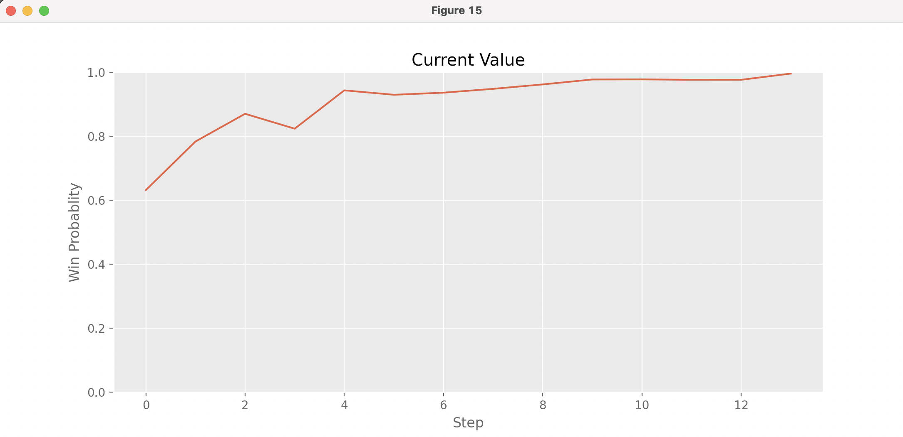
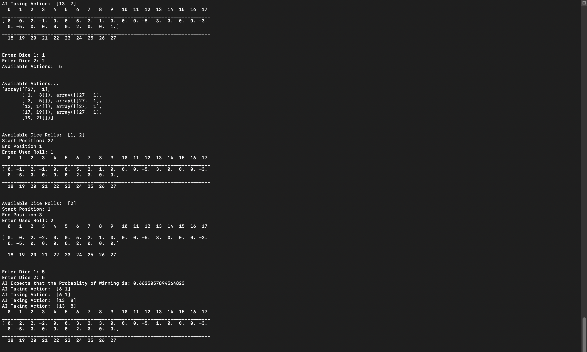

# TD-Gammon

This is the implementation of the original TD Gammon algorithm by  Gerald Tesauro at IBM's Thomas J. Watson Research Center. The Agent uses Self-Play Reinforcement learning, and a non linear function approximater I.e. a Neural Network. I have trained the program over 30,000 games and used a single hidden layer and 80 units. The original program used 2-ply search to select it's moves but since the program is currently only capable of running on a CPU performing a search with depth greater than 1 is far too expensive as it takes a long time to select a movie (even with alpha-beta pruning).

## Technologies

 Project is created with:
* Python 3
* Pytorch
* Numpy

## Training Files

 Files Required to train agent:
* env.py
* Agent.py
* model.py

## Testing Files

 Files to test agent:
* test_agent.py
* test.py
* Play.py (Used to play against human)

## Weights File:

 Weights to load in neural network:
* model.pth (trained over 30,000 games of self-play)
* model_weak.pth (trained over 3000 games of self-play)

## Setup

 Download by cloning this repository and store all the files in the same folder and run the following         commands:

 Start the training (Enter number of iterations i.e. games of self-play RL)
$ python model.py

 To check if agent is learning, run this command which pits the agent against a player who always selects the first action amongst all the possible actions.

$ python test.py

 To play against a slightly better agent let it play against a better agent trained with around 3000 games.

$ python test_agent.py

* Note - To run smoothly move all the files into a single folders i.e. remove the Train, Test, Play.

## Images

* In Play.py the program outputs a graph which predicts the win rate at that ply.

* Current interface in Play.py

## To-Do 

* Implement a GUI, currently its just a linear representation of the board with numbers between 0-27
* Enable GPU support as currently training takes a long time.

## References 

* Tesauro, Gerald (March 1995). "Temporal Difference Learning and TD-Gammon". Communications of the ACM. 38 (3). doi:10.1145/203330.203343. Retrieved Nov 1, 2013.
* https://deepmind.com/learning-resources/-introduction-reinforcement-learning-david-silver

 

